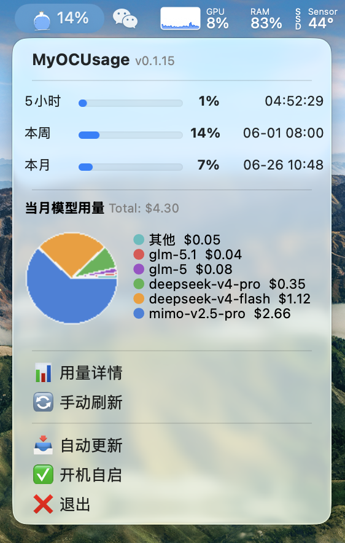

# OpenCode 用量监控

macOS 菜单栏应用，在状态栏实时显示 OpenCode Go订阅的 5 小时 / 本周 / 本月用量及各模型用量饼图。

 

## 功能

-   **动态瓶子图标**：用量越低瓶子越满、越直立；用量越高瓶子越空、越倾斜；颜色从🔵蓝→🟠橙→🔴红渐变
-   **三个时段**：5 小时滚动、本周、本月用量（状态栏优先显示最高值）
-   **模型用量饼图**：下拉菜单内嵌 Pillow 绘制的饼图，按模型拆分当月用量，右侧图例带颜色对应圆点
-   **原生进度条**：用量可视化的 macOS 原生进度条（NSProgressIndicator）
-   **百分比/倒计时**：用量百分比（加粗）和重置剩余时间（≤24h 显示 HH:MM:SS，>24h 显示 MM-DD HH:MM）
-   **动画效果**：刷新时瓶子过冲回弹，用量重置时摇晃站稳，手动刷新轻晃反馈
-   **自动刷新**：默认每 60 秒自动更新
-   **自动更新**：自动检测 GitHub 新版本，一键下载替换并重启
-   **防重复启动**：自动检测已有进程，避免重复运行
-   **后台运行**：启动后自动守护进程化，不占用终端

## 安装

### 前置要求

-   macOS 10.15+
-   Python 3.10+
-   已注册 [OpenCode](https://opencode.ai) 账号并登录

### 步骤

```bash
# 1. 克隆仓库
git clone https://github.com/你的用户名/myocusage.git
cd myocusage

# 2. 安装依赖
pip3 install -r requirements.txt

# 3. 配置
cp config.json.sample config.json
```

## 配置

打开 `config.json`，参照以下方式填写：

### 获取配置信息

| 字段 | 获取方式 |
|------|----------|
| `cookies` | 浏览器打开 [opencode.ai](https://opencode.ai) 并登录，按 `F12` → **Network** → 过滤 `_server` → 点击任意请求 → **Request Headers** → 复制 `Cookie` 字段的完整值（格式如 `oc_locale=zh; auth=Fe26.2**...**`） |
| `workspace_id` | 访问 `https://opencode.ai/workspace/{你的工作区ID}/usage`，从地址栏复制中间那串 ID（格式如 `wrk_xxx...`） |
| `server_id` | 访问 `https://opencode.ai/workspace/{你的工作区ID}/go`，F12 → Network → 过滤 `_server` → 任意请求 → **Request Headers** → 复制 `x-server-id`（当前为 `c7389bd0e731f80f49593e5ee53835475f4e28594dd6bd83eb229bab753498cd`，可能随部署变更） |
| `server_instance` | 同上，复制 `x-server-instance`（通常为 `server-fn:3`） |
| `plan_monthly_limit` | 可选。如果菜单栏只显示百分比不显示数值，可在此填入你的月计划金额上限（美元），用于计算进度条 |
| `model_server_id` | 可选。获取各 AI 模型用量明细所需的 server_id，从返回 `usage` 数组的 `_server` 请求中复制（当前为 `15702f3a12ff8bff357f8c2aa154a17e65b746d5f6b96adc9002c86ee0c15205`） |
| `model_server_instance` | 可选。同上请求的 `x-server-instance`（通常为 `server-fn:0`）。填写后下拉菜单显示模型用量饼图 |

### 配置文件示例

```json
{
  "cookies": "oc_locale=zh; auth=Fe26.2**你的认证token**",
  "workspace_id": "wrk_xxxxxxxxxxxxxxxxxxxxx",
  "server_id": "c7389bd0e731f80f49593e5ee53835475f4e28594dd6bd83eb229bab753498cd",
  "server_instance": "server-fn:3",
  "plan_monthly_limit": null,
  "refresh_interval": 60,
  "model_server_id": "15702f3a12ff8bff357f8c2aa154a17e65b746d5f6b96adc9002c86ee0c15205",
  "model_server_instance": "server-fn:0"
}
```

> **注意**：Cookie 会过期（通常几天到几周），过期后状态栏会显示 🔒 图标，重新按上述步骤复制即可。

## 使用

```bash
python3 myocusage_status.py
```

启动后终端自动返回，应用在后台运行。再次运行脚本会检测已有进程并提示退出。

### 菜单项

-   **MyOCUsage vX.X.X**：标题行，点击跳转 GitHub 仓库
-   **5 小时 / 本周 / 本月**：各时段用量百分比（加粗）、原生进度条和重置倒计时
-   **模型用量**：当月各 AI 模型用量饼图 + 图例（需配置 `model_server_id`）
-   **📊 用量详情**：在浏览器中打开用量详情页
-   **🔄 手动刷新**：立即刷新用量数据（瓶子轻晃反馈）
-   **📥 自动更新**：检查 GitHub 新版本，有更新时提示一键下载替换
-   **✅ / 🔳 开机自启**：设置登录时自动启动（仅写入 plist，不调用 launchctl load 以避免重复进程）
-   **❌ 退出**：退出应用

## 技术说明

-   通过 OpenCode 的 Convex RPC 端点（`_server`）获取用量数据
-   内置 Convex JavaScript 响应格式解析器（处理 `!0`/`!1`、`$R[N]={...}` 等 JS 表达式）
-   使用 `rumps` + `PyObjC` 实现 macOS 菜单栏；图标由 `Pillow` 实时绘制（512×512 → 44×44），饼图由 `Pillow.pieslice` 绘制（80×80）
-   支持动画帧序列：过冲回弹、阻尼摇晃（通过 `rumps.Timer` 驱动）
-   自动更新通过 GitHub API 比对 `VERSION` 字段，下载后替换当前脚本文件，再次点击菜单项重启

## 文件结构

```
myocusage/
├── myocusage_status.py   # 主程序
├── config.json           # 配置文件（.gitignore 排除）
├── config.json.sample    # 配置模板
├── requirements.txt      # Python 依赖
└── run.sh                # 一键安装启动脚本
```

## License

MIT

## 致谢

参考 [wiscaksono/opencode-usage](https://github.com/wiscaksono/opencode-usage) 实现。原项目需完整安装 Xcode 并自行编译，稍显繁琐，故用 Python 重写了本版本，按需取用。

